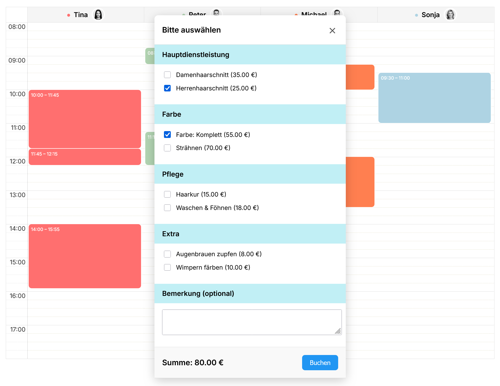
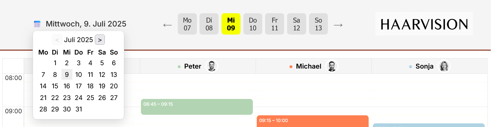

MitDenkt ist eine Webanwendung zur Verwaltung von Buchungen in einem zeitbasierten Grid-System.
Kunden können sich registrieren, einloggen, verfügbare Zeiten einsehen und Buchungen mit wenigen Klicks vornehmen.
Ideal für Friseure, Kosmetikstudios oder andere Dienstleistungen mit Terminvergabe.
  
   ## Features

  - Benutzer-Authentifizierung für Kunden mit AspNetCore.Identity
  - Dynamisches Kalender-Grid mit 1-Stunden-Slots, unterteilt in 15-Minuten-Bereiche (buchbar)
  - Minikalender im Header zur Auswahl von Tagen und Monaten
  - Wochentagauswahl mit zugehörigem Datum
  - Farbzuweisung für einzelne Mitarbeiter zur besseren Übersicht
  - Buchung von Dienstleistungen in einem eigenen Modal-Fenster mit automatischer Summierung von Preis und Zeit
  - Grafische Darstellung der gebuchten Dienstleistungen im Grid
  - Vollständig containerisiert mit Docker & SQL Server
  - Zeitzonen-Korrektur für konsistente Buchungen (z. B. Europe/Berlin)
  - RESTful API (JSON) & modernes Frontend (JS, Bootstrap)

  ## Technologie-Stack

  - ASP.NET Core 8.0.4
  - JavaScript (ES6)
  - HTML5 & CSS3 (eigene Styles)
  - FullCalendar Scheduler (CDN)
  - Google Fonts ("Inter")
  - Docker & SQL Server


## Screenshots

 Kalendar mit getätigten Buchungen


Buchungsfenster mit Dienstleistungen und summierten Preis



Detailansicht des Mini-Kalendars



## Schnellstart mit Docker

### 1. .env Datei erstellen

```
DB_HOST=mitdenkt-db
DB_NAME=MitDenktDb
DB_USER=sa
DB_PASSWORD=Ghr!24x@Db
```


### 2. Docker-Container starten

```
docker-compose up --build
```


### 3. Datenbank-Migration (wenn nötig)

bash
docker exec -it mitdenkt-app dotnet ef database update


### 4. Im Browser öffnen

http://localhost:5057


### 5. Login 
Nach dem ersten Start ist ein Demo-Nutzer automatisch vorhanden (siehe dbseeder.cs im Ordner Data):

- Benutzername: demonutzer@mitdenkt.de
- Passwort: GrandiosesPasswort1!


## Weiterentwicklungsideen

- Optimierung für mobile Endgeräte
- Separate Ansicht für Mitarbeiter zur Planung von Pausen, Urlaub, Verfügbarkeiten
- Integration von Zahlungen & automatische Terminerinnerungen
